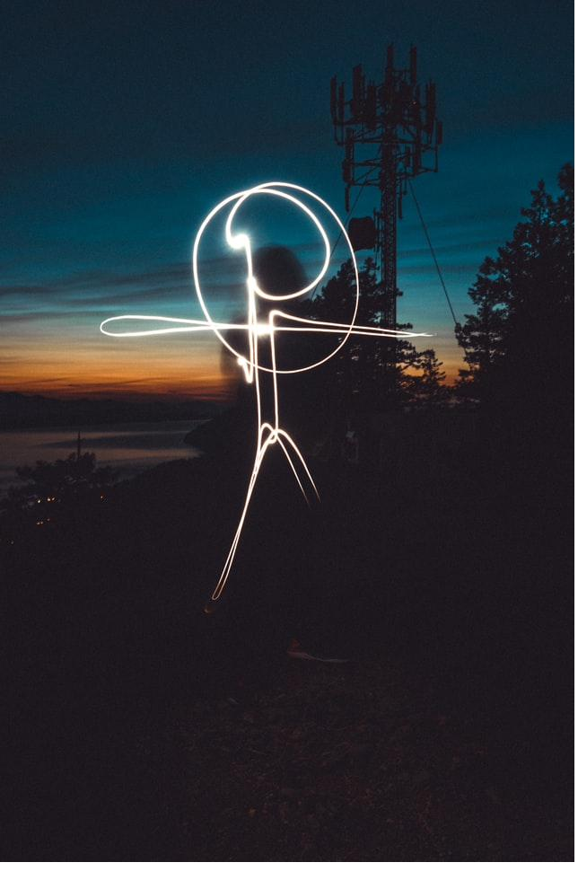

```{=html}
<section class="eh-hero">
  <div class="eh-hero-text">
    <div class="eh-eyebrow">event-driven analytics</div>
    <h1 class="eh-headline">Your warehouse maps the known territory. <span class="eh-headline-accent">Now, let&rsquo;s expand what you can see.</span></h1>
    <div class="eh-nameline">Dan Manastireanu &middot; analytics engineering &middot; R / BI</div>
    <div class="eh-cta-row">
      <a class="eh-btn" href="blog.html">
        <span class="eh-btn-label">read()</span>
        <span class="eh-btn-sub">the analyses, with R code</span>
      </a>
      <a class="eh-btn" href="explore.html">
        <span class="eh-btn-label">explore()</span>
        <span class="eh-btn-sub">the story in the data</span>
      </a>
    </div>
  </div>
  <div class="eh-hero-visual">
<svg class="eh-hero-svg" viewBox="0 0 640 280" role="img" aria-labelledby="ehHeroTitle ehHeroDesc" xmlns="http://www.w3.org/2000/svg">
  <title id="ehHeroTitle">Unknown events becoming known</title>
  <desc id="ehHeroDesc">Event dots drift through a chaotic unmapped field. One crosses into a small two-column warehouse table and its row is written in, while at the same moment other events flare up and fade, unseen, in the open field.</desc>
  <g class="eh-chaos-field">
      <path class="eh-chaos" d="M392 210 Q 396 197, 383 199" stroke-width="1.3" opacity="0.41"/>
      <path class="eh-chaos" d="M374 254 Q 373 266, 366 283" stroke-width="0.9" opacity="0.27"/>
      <path class="eh-chaos" d="M38 180 Q 41 181, 27 199" stroke-width="1.1" opacity="0.48"/>
      <path class="eh-chaos" d="M56 56 Q 49 70, 60 66" stroke-width="0.6" opacity="0.40"/>
      <path class="eh-chaos" d="M430 97 Q 423 114, 422 126" stroke-width="0.8" opacity="0.25"/>
      <path class="eh-chaos-hi" d="M359 199 Q 349 213, 354 211" stroke-width="0.8" opacity="0.45"/>
      <path class="eh-chaos-hi" d="M354 251 Q 375 255, 388 268" stroke-width="1.2" opacity="0.17"/>
      <path class="eh-chaos" d="M432 114 Q 423 101, 421 81" stroke-width="0.9" opacity="0.24"/>
      <path class="eh-chaos" d="M342 146 Q 327 156, 324 153" stroke-width="0.8" opacity="0.38"/>
      <path class="eh-chaos" d="M197 105 Q 186 112, 182 112" stroke-width="1.3" opacity="0.33"/>
      <path class="eh-chaos" d="M238 198 Q 254 194, 256 204" stroke-width="1.1" opacity="0.56"/>
      <path class="eh-chaos" d="M333 35 Q 322 38, 317 33" stroke-width="0.7" opacity="0.40"/>
      <path class="eh-chaos" d="M61 116 Q 74 106, 72 111" stroke-width="0.9" opacity="0.32"/>
      <path class="eh-chaos" d="M53 239 Q 50 252, 49 264" stroke-width="1.3" opacity="0.47"/>
      <path class="eh-chaos" d="M110 236 Q 84 247, 77 239" stroke-width="0.9" opacity="0.32"/>
      <path class="eh-chaos" d="M85 48 Q 84 57, 103 46" stroke-width="0.8" opacity="0.37"/>
      <path class="eh-chaos-hi" d="M239 93 Q 222 111, 219 116" stroke-width="1.4" opacity="0.55"/>
      <path class="eh-chaos" d="M310 35 Q 291 27, 284 6" stroke-width="0.6" opacity="0.41"/>
      <path class="eh-chaos" d="M272 220 Q 282 229, 280 250" stroke-width="0.9" opacity="0.47"/>
      <path class="eh-chaos" d="M431 75 Q 419 82, 413 82" stroke-width="0.6" opacity="0.26"/>
      <path class="eh-chaos" d="M138 61 Q 129 43, 107 37" stroke-width="0.9" opacity="0.27"/>
      <path class="eh-chaos-hi" d="M52 135 Q 31 137, 21 128" stroke-width="1.1" opacity="0.42"/>
      <path class="eh-chaos" d="M276 259 Q 293 253, 305 253" stroke-width="1.3" opacity="0.28"/>
      <path class="eh-chaos-hi" d="M175 208 Q 169 204, 159 204" stroke-width="0.6" opacity="0.50"/>
      <path class="eh-chaos" d="M207 144 Q 216 128, 214 124" stroke-width="0.7" opacity="0.35"/>
      <path class="eh-chaos" d="M383 109 Q 375 101, 377 82" stroke-width="0.9" opacity="0.19"/>
      <path class="eh-chaos" d="M363 110 Q 364 103, 354 107" stroke-width="1.0" opacity="0.48"/>
      <path class="eh-chaos" d="M208 44 Q 210 51, 204 66" stroke-width="1.4" opacity="0.33"/>
      <path class="eh-chaos" d="M97 151 Q 104 171, 110 191" stroke-width="0.6" opacity="0.49"/>
      <path class="eh-chaos" d="M423 184 Q 403 197, 400 193" stroke-width="1.1" opacity="0.26"/>
      <path class="eh-chaos" d="M267 132 Q 262 136, 257 138" stroke-width="0.9" opacity="0.48"/>
      <path class="eh-chaos" d="M369 204 Q 357 221, 368 215" stroke-width="1.0" opacity="0.26"/>
      <path class="eh-chaos" d="M51 230 Q 36 219, 37 191" stroke-width="1.1" opacity="0.37"/>
      <path class="eh-chaos" d="M399 180 Q 385 168, 363 164" stroke-width="1.3" opacity="0.17"/>
      <path class="eh-chaos" d="M12 156 Q 16 132, 14 116" stroke-width="1.0" opacity="0.59"/>
      <path class="eh-chaos" d="M361 196 Q 340 193, 325 184" stroke-width="1.1" opacity="0.23"/>
      <path class="eh-chaos" d="M184 31 Q 180 16, 158 19" stroke-width="0.9" opacity="0.24"/>
      <path class="eh-chaos-hi" d="M202 194 Q 212 205, 234 204" stroke-width="1.3" opacity="0.57"/>
      <path class="eh-chaos" d="M307 70 Q 298 85, 301 89" stroke-width="1.1" opacity="0.49"/>
      <path class="eh-chaos-hi" d="M420 174 Q 418 190, 439 181" stroke-width="1.3" opacity="0.18"/>
      <path class="eh-chaos" d="M60 128 Q 61 122, 50 129" stroke-width="1.2" opacity="0.33"/>
      <path class="eh-chaos" d="M83 32 Q 82 53, 89 66" stroke-width="1.2" opacity="0.50"/>
      <path class="eh-chaos" d="M441 183 Q 414 202, 405 202" stroke-width="1.1" opacity="0.21"/>
      <path class="eh-chaos" d="M31 49 Q 45 38, 56 32" stroke-width="0.8" opacity="0.37"/>
      <path class="eh-chaos" d="M238 156 Q 231 146, 214 147" stroke-width="1.3" opacity="0.60"/>
      <path class="eh-chaos" d="M62 149 Q 58 161, 65 160" stroke-width="1.3" opacity="0.50"/>
      <path class="eh-chaos-hi" d="M243 215 Q 261 205, 256 218" stroke-width="0.7" opacity="0.41"/>
      <path class="eh-chaos" d="M37 160 Q 64 155, 73 167" stroke-width="0.8" opacity="0.26"/>
      <path class="eh-chaos" d="M324 261 Q 315 276, 326 272" stroke-width="1.0" opacity="0.28"/>
      <path class="eh-chaos" d="M366 151 Q 372 160, 374 173" stroke-width="0.9" opacity="0.30"/>
      <path class="eh-chaos" d="M269 246 Q 261 233, 254 219" stroke-width="0.7" opacity="0.25"/>
      <path class="eh-chaos" d="M150 228 Q 169 210, 172 208" stroke-width="0.6" opacity="0.57"/>
      <path class="eh-chaos" d="M338 249 Q 349 246, 346 258" stroke-width="0.9" opacity="0.43"/>
      <path class="eh-chaos" d="M433 163 Q 427 173, 429 175" stroke-width="0.8" opacity="0.13"/>
      <path class="eh-chaos" d="M433 103 Q 440 103, 434 115" stroke-width="0.7" opacity="0.20"/>
      <path class="eh-chaos" d="M432 216 Q 452 206, 460 208" stroke-width="0.9" opacity="0.28"/>
      <path class="eh-chaos" d="M8 198 Q -12 209, -15 204" stroke-width="1.2" opacity="0.49"/>
      <path class="eh-chaos" d="M243 164 Q 241 141, 216 142" stroke-width="1.1" opacity="0.53"/>
      <path class="eh-chaos" d="M374 201 Q 396 187, 399 193" stroke-width="0.8" opacity="0.46"/>
      <path class="eh-chaos-hi" d="M186 206 Q 190 198, 193 191" stroke-width="1.0" opacity="0.53"/>
      <path class="eh-chaos" d="M15 151 Q 26 161, 30 179" stroke-width="1.3" opacity="0.40"/>
      <path class="eh-chaos" d="M18 243 Q 10 246, 6 244" stroke-width="0.6" opacity="0.53"/>
      <path class="eh-chaos" d="M117 202 Q 127 212, 119 239" stroke-width="1.1" opacity="0.44"/>
      <path class="eh-chaos" d="M40 116 Q 54 109, 58 114" stroke-width="1.4" opacity="0.40"/>
      <path class="eh-chaos" d="M130 250 Q 122 237, 94 245" stroke-width="0.8" opacity="0.24"/>
      <path class="eh-chaos" d="M20 28 Q 4 15, -2 -8" stroke-width="1.3" opacity="0.30"/>
      <path class="eh-chaos" d="M159 65 Q 173 80, 193 88" stroke-width="1.3" opacity="0.59"/>
      <path class="eh-chaos" d="M445 233 Q 436 231, 413 243" stroke-width="0.8" opacity="0.15"/>
      <path class="eh-chaos" d="M283 79 Q 287 57, 277 49" stroke-width="1.4" opacity="0.30"/>
      <path class="eh-chaos" d="M139 70 Q 130 61, 123 49" stroke-width="1.1" opacity="0.56"/>
      <path class="eh-chaos" d="M135 52 Q 140 71, 154 82" stroke-width="1.0" opacity="0.38"/>
      <path class="eh-chaos-hi" d="M227 37 Q 247 25, 261 19" stroke-width="0.7" opacity="0.46"/>
      <path class="eh-chaos" d="M20 43 Q 19 47, 7 63" stroke-width="1.4" opacity="0.57"/>
      <path class="eh-chaos" d="M225 159 Q 226 167, 210 191" stroke-width="1.1" opacity="0.28"/>
      <path class="eh-chaos" d="M77 238 Q 75 243, 73 249" stroke-width="1.2" opacity="0.48"/>
      <path class="eh-chaos" d="M318 162 Q 329 176, 335 197" stroke-width="0.6" opacity="0.44"/>
      <path class="eh-chaos" d="M237 20 Q 236 25, 252 11" stroke-width="0.7" opacity="0.23"/>
      <path class="eh-chaos" d="M412 147 Q 410 145, 403 148" stroke-width="1.0" opacity="0.22"/>
      <path class="eh-chaos-hi" d="M62 165 Q 81 152, 78 160" stroke-width="0.8" opacity="0.30"/>
      <path class="eh-chaos" d="M278 30 Q 285 22, 292 15" stroke-width="1.3" opacity="0.40"/>
      <path class="eh-chaos" d="M128 189 Q 126 169, 116 158" stroke-width="1.0" opacity="0.34"/>
      <path class="eh-chaos-hi" d="M385 218 Q 385 204, 396 180" stroke-width="0.9" opacity="0.22"/>
      <path class="eh-chaos" d="M273 112 Q 274 129, 285 136" stroke-width="0.7" opacity="0.51"/>
      <path class="eh-chaos" d="M291 232 Q 299 209, 296 196" stroke-width="1.3" opacity="0.59"/>
      <path class="eh-chaos" d="M8 123 Q 12 95, 2 81" stroke-width="0.9" opacity="0.55"/>
      <path class="eh-chaos" d="M93 167 Q 72 177, 74 164" stroke-width="1.2" opacity="0.26"/>
      <path class="eh-chaos" d="M60 152 Q 73 148, 81 148" stroke-width="1.0" opacity="0.39"/>
      <path class="eh-chaos" d="M156 94 Q 164 104, 181 106" stroke-width="0.7" opacity="0.42"/>
      <path class="eh-chaos-hi" d="M226 248 Q 239 236, 235 242" stroke-width="1.1" opacity="0.43"/>
      <path class="eh-chaos" d="M45 20 Q 33 39, 26 51" stroke-width="1.1" opacity="0.21"/>
      <path class="eh-chaos-hi" d="M228 30 Q 229 11, 222 -2" stroke-width="0.8" opacity="0.36"/>
      <path class="eh-chaos" d="M372 243 Q 369 256, 364 272" stroke-width="0.9" opacity="0.43"/>
      <path class="eh-chaos" d="M250 205 Q 257 184, 245 182" stroke-width="1.3" opacity="0.27"/>
      <path class="eh-chaos" d="M356 127 Q 368 126, 362 144" stroke-width="1.2" opacity="0.30"/>
      <path class="eh-chaos-hi" d="M407 117 Q 397 131, 395 138" stroke-width="1.3" opacity="0.19"/>
      <path class="eh-chaos-hi" d="M93 33 Q 90 58, 103 67" stroke-width="1.3" opacity="0.51"/>
      <path class="eh-chaos" d="M370 257 Q 347 268, 341 262" stroke-width="1.2" opacity="0.17"/>
      <path class="eh-chaos" d="M270 124 Q 276 143, 282 162" stroke-width="0.7" opacity="0.44"/>
      <path class="eh-chaos" d="M150 103 Q 138 107, 151 89" stroke-width="1.1" opacity="0.34"/>
      <path class="eh-chaos" d="M412 132 Q 397 136, 400 121" stroke-width="1.0" opacity="0.27"/>
      <path class="eh-chaos" d="M20 91 Q 12 91, 18 77" stroke-width="0.9" opacity="0.46"/>
      <path class="eh-chaos-hi" d="M244 177 Q 256 186, 284 178" stroke-width="1.0" opacity="0.37"/>
      <path class="eh-chaos" d="M55 131 Q 66 136, 83 137" stroke-width="1.4" opacity="0.26"/>
      <path class="eh-chaos" d="M462 256 Q 474 247, 493 231" stroke-width="1.1" opacity="0.13"/>
      <path class="eh-chaos" d="M152 182 Q 135 183, 135 168" stroke-width="1.0" opacity="0.51"/>
      <path class="eh-chaos-hi" d="M285 22 Q 269 32, 253 42" stroke-width="1.1" opacity="0.33"/>
      <path class="eh-chaos" d="M352 234 Q 346 224, 348 205" stroke-width="0.9" opacity="0.52"/>
      <path class="eh-chaos" d="M261 23 Q 268 44, 280 60" stroke-width="0.6" opacity="0.18"/>
      <path class="eh-chaos" d="M202 217 Q 188 243, 191 254" stroke-width="0.6" opacity="0.32"/>
      <path class="eh-chaos" d="M96 143 Q 103 123, 94 121" stroke-width="1.1" opacity="0.43"/>
      <path class="eh-chaos" d="M384 132 Q 377 115, 353 114" stroke-width="1.2" opacity="0.34"/>
      <path class="eh-chaos" d="M150 210 Q 150 208, 170 186" stroke-width="1.2" opacity="0.59"/>
      <path class="eh-chaos" d="M287 180 Q 291 185, 301 185" stroke-width="1.1" opacity="0.30"/>
      <path class="eh-chaos" d="M168 245 Q 177 236, 177 235" stroke-width="0.9" opacity="0.25"/>
      <path class="eh-chaos" d="M126 172 Q 119 149, 88 151" stroke-width="0.7" opacity="0.50"/>
      <path class="eh-chaos" d="M290 193 Q 278 196, 279 187" stroke-width="1.3" opacity="0.34"/>
      <circle class="eh-chaos-dot" cx="104" cy="96" r="3.7" opacity="0.49"/>
      <circle class="eh-chaos-dot" cx="195" cy="126" r="2.4" opacity="0.41"/>
      <circle class="eh-chaos-dot" cx="282" cy="125" r="2.6" opacity="0.35"/>
      <circle class="eh-chaos-dot" cx="362" cy="163" r="2.7" opacity="0.39"/>
      <circle class="eh-chaos-dot" cx="90" cy="232" r="4.2" opacity="0.43"/>
      <circle class="eh-chaos-dot" cx="334" cy="92" r="2.6" opacity="0.43"/>
      <circle class="eh-chaos-dot" cx="398" cy="86" r="2.7" opacity="0.39"/>
      <circle class="eh-chaos-dot" cx="304" cy="257" r="2.9" opacity="0.42"/>
      <circle class="eh-chaos-dot" cx="363" cy="251" r="4.5" opacity="0.40"/>
      <circle class="eh-chaos-dot" cx="249" cy="232" r="2.7" opacity="0.46"/>
      <circle class="eh-chaos-dot" cx="121" cy="155" r="4.2" opacity="0.28"/>
      <circle class="eh-chaos-dot" cx="438" cy="243" r="3.7" opacity="0.58"/>
      <circle class="eh-chaos-dot" cx="62" cy="110" r="1.4" opacity="0.47"/>
      <circle class="eh-chaos-dot" cx="369" cy="83" r="2.5" opacity="0.36"/>
      <circle class="eh-chaos-dot" cx="178" cy="169" r="2.5" opacity="0.25"/>
      <circle class="eh-chaos-dot" cx="103" cy="169" r="2.7" opacity="0.25"/>
  </g>
  <path id="ehGradPath" d="M60 175 C 160 145, 280 185, 400 168 L 462 199" fill="none" stroke="none"/>
  <path class="eh-entry" d="M428 172 L 462 199" fill="none" stroke-width="1.2"/>
  <rect class="eh-dw" x="452" y="66" width="168" height="150" rx="3"/>
  <text class="eh-mono eh-dw-title" x="536" y="54" text-anchor="middle" font-size="10">known territory / your DW</text>
  <line class="eh-dw-line" x1="452" y1="92" x2="620" y2="92"/>
  <line class="eh-dw-line" x1="560" y1="66" x2="560" y2="216"/>
  <text class="eh-mono eh-t-muted" x="462" y="84" font-size="10">event</text>
  <text class="eh-mono eh-t-muted" x="570" y="84" font-size="10">count</text>
  <text class="eh-mono eh-t-text" x="462" y="115" font-size="10">page_view</text>
  <text class="eh-mono eh-t-muted" x="570" y="115" font-size="10">18,204</text>
  <text class="eh-mono eh-t-accent" x="462" y="145" font-size="10">purchase</text>
  <text class="eh-mono eh-t-accent-dim" x="570" y="145" font-size="10">1,042</text>
  <text class="eh-mono eh-t-text" x="462" y="175" font-size="10">signup</text>
  <text class="eh-mono eh-t-muted" x="570" y="175" font-size="10">3,311</text>
  <circle class="eh-slot" cx="462" cy="199" r="3.5" fill="none" stroke-width="0.8" stroke-dasharray="2 2"/>

  <g class="eh-anim">
    <text class="eh-mono eh-t-accent" x="472" y="203" font-size="10" opacity="0">checkout_retry
      <animate attributeName="opacity" values="0;0;1;1;0" keyTimes="0;0.50;0.54;0.96;1" dur="5.5s" repeatCount="indefinite"/>
    </text>
    <text class="eh-mono eh-t-accent-dim" x="570" y="203" font-size="10" opacity="0">+1
      <animate attributeName="opacity" values="0;0;1;1;0" keyTimes="0;0.50;0.54;0.96;1" dur="5.5s" repeatCount="indefinite"/>
    </text>
    <g opacity="1">
      <animate attributeName="opacity" values="1;1;0;0" keyTimes="0;0.27;0.32;1" dur="5.5s" repeatCount="indefinite"/>
      <circle class="eh-mover" r="4">
        <animateMotion dur="5.5s" repeatCount="indefinite"><mpath href="#ehGradPath"/></animateMotion>
      </circle>
    </g>
    <g opacity="0">
      <animate attributeName="opacity" values="0;0;1;1;0;0" keyTimes="0;0.29;0.33;0.47;0.52;1" dur="5.5s" repeatCount="indefinite"/>
      <circle class="eh-fill-accent" r="4">
        <animateMotion dur="5.5s" repeatCount="indefinite"><mpath href="#ehGradPath"/></animateMotion>
      </circle>
    </g>
    <circle class="eh-mover" r="2.2" opacity="0">
      <animateMotion dur="5.2s" begin="0.4s" repeatCount="indefinite" path="M20 60 C 120 40, 200 120, 320 95"/>
      <animate attributeName="opacity" values="0;0.5;0.5;0;0" keyTimes="0;0.15;0.7;0.9;1" dur="5.2s" begin="0.4s" repeatCount="indefinite"/>
    </circle>
    <circle class="eh-mover" r="3.8" opacity="0">
      <animateMotion dur="6.5s" begin="1.8s" repeatCount="indefinite" path="M35 230 C 140 250, 240 180, 380 210"/>
      <animate attributeName="opacity" values="0;0.5;0.5;0;0" keyTimes="0;0.15;0.7;0.9;1" dur="6.5s" begin="1.8s" repeatCount="indefinite"/>
    </circle>
    <circle class="eh-mover" r="1.6" opacity="0">
      <animateMotion dur="4.6s" begin="3.1s" repeatCount="indefinite" path="M15 150 C 100 120, 210 190, 330 150"/>
      <animate attributeName="opacity" values="0;0.5;0.5;0;0" keyTimes="0;0.15;0.7;0.9;1" dur="4.6s" begin="3.1s" repeatCount="indefinite"/>
    </circle>
    <circle class="eh-mover" r="2.8" opacity="0">
      <animateMotion dur="7.0s" begin="2.2s" repeatCount="indefinite" path="M50 40 C 160 80, 260 30, 400 70"/>
      <animate attributeName="opacity" values="0;0.5;0.5;0;0" keyTimes="0;0.15;0.7;0.9;1" dur="7.0s" begin="2.2s" repeatCount="indefinite"/>
    </circle>
    <circle class="eh-mover" r="4.4" opacity="0">
      <animateMotion dur="5.8s" begin="0.0s" repeatCount="indefinite" path="M25 200 C 130 160, 230 240, 360 190"/>
      <animate attributeName="opacity" values="0;0.5;0.5;0;0" keyTimes="0;0.15;0.7;0.9;1" dur="5.8s" begin="0.0s" repeatCount="indefinite"/>
    </circle>
    <circle class="eh-mover" r="2.0" opacity="0">
      <animateMotion dur="6.2s" begin="4.0s" repeatCount="indefinite" path="M70 100 C 170 140, 280 90, 420 120"/>
      <animate attributeName="opacity" values="0;0.5;0.5;0;0" keyTimes="0;0.15;0.7;0.9;1" dur="6.2s" begin="4.0s" repeatCount="indefinite"/>
    </circle>
    <circle class="eh-mover" r="3.2" opacity="0">
      <animateMotion dur="5.0s" begin="2.7s" repeatCount="indefinite" path="M30 175 C 120 210, 260 140, 410 235"/>
      <animate attributeName="opacity" values="0;0.5;0.5;0;0" keyTimes="0;0.15;0.7;0.9;1" dur="5.0s" begin="2.7s" repeatCount="indefinite"/>
    </circle>
    <circle class="eh-fill-accent" cx="130" cy="80" r="3.6" opacity="0">
      <animate attributeName="opacity" values="0;0;1;1;0;0" keyTimes="0;0.50;0.53;0.58;0.66;1" dur="5.5s" repeatCount="indefinite"/>
    </circle>
    <circle class="eh-ring" cx="130" cy="80" r="4" fill="none" stroke-width="1" opacity="0">
      <animate attributeName="opacity" values="0;0;0.8;0;0" keyTimes="0;0.51;0.54;0.63;1" dur="5.5s" repeatCount="indefinite"/>
      <animate attributeName="r" values="4;4;15;15" keyTimes="0;0.5;0.63;1" dur="5.5s" repeatCount="indefinite"/>
    </circle>
    <circle class="eh-fill-accent" cx="265" cy="225" r="2.8" opacity="0">
      <animate attributeName="opacity" values="0;0;1;1;0;0" keyTimes="0;0.50;0.53;0.58;0.66;1" dur="5.5s" repeatCount="indefinite"/>
    </circle>
    <circle class="eh-ring" cx="265" cy="225" r="4" fill="none" stroke-width="1" opacity="0">
      <animate attributeName="opacity" values="0;0;0.8;0;0" keyTimes="0;0.51;0.54;0.63;1" dur="5.5s" repeatCount="indefinite"/>
      <animate attributeName="r" values="4;4;15;15" keyTimes="0;0.5;0.63;1" dur="5.5s" repeatCount="indefinite"/>
    </circle>
    <circle class="eh-fill-accent" cx="350" cy="90" r="4.2" opacity="0">
      <animate attributeName="opacity" values="0;0;1;1;0;0" keyTimes="0;0.50;0.53;0.58;0.66;1" dur="5.5s" repeatCount="indefinite"/>
    </circle>
    <circle class="eh-ring" cx="350" cy="90" r="4" fill="none" stroke-width="1" opacity="0">
      <animate attributeName="opacity" values="0;0;0.8;0;0" keyTimes="0;0.51;0.54;0.63;1" dur="5.5s" repeatCount="indefinite"/>
      <animate attributeName="r" values="4;4;15;15" keyTimes="0;0.5;0.63;1" dur="5.5s" repeatCount="indefinite"/>
    </circle>
  </g>

  <g class="eh-static">
    <circle class="eh-fill-accent" cx="404" cy="167" r="4"/>
    <text class="eh-mono eh-t-accent" x="472" y="203" font-size="10">checkout_retry</text>
    <text class="eh-mono eh-t-accent-dim" x="570" y="203" font-size="10">+1</text>
    <circle class="eh-fill-accent" cx="265" cy="225" r="2.8" opacity="0.7"/>
    <circle class="eh-fill-accent" cx="130" cy="80" r="3.6" opacity="0.45"/>
  </g>

  <text class="eh-mono eh-t-faint" x="320" y="272" text-anchor="middle" font-size="10">one captured &#183; the rest light up where nobody is watching</text>
</svg>
  </div>
</section>
```

::: {.eh-section}
<div class="eh-section-label">latest analyses</div>

::: {#latest-analyses}
:::

:::

```{=html}
<section class="eh-section">
  <div class="eh-section-label">start here</div>
  <div class="eh-guides">
    <a class="eh-guide-card" href="guide/getting-started/what-are-events.html">
      <span class="eh-guide-cat">getting started</span>
      <span class="eh-guide-title">What are events?</span>
    </a>
    <a class="eh-guide-card" href="guide/getting-started/why-event-driven.html">
      <span class="eh-guide-cat">getting started</span>
      <span class="eh-guide-title">Why event-driven analytics?</span>
    </a>
    <a class="eh-guide-card" href="guide/dashboards/dashboard-design.html">
      <span class="eh-guide-cat">dashboards</span>
      <span class="eh-guide-title">Event dashboard design</span>
    </a>
  </div>
</section>

<section class="eh-section">
  <div class="eh-know">
    <div class="eh-know-card">
      <div class="eh-know-label">why this exists</div>
      <div class="eh-know-text">Most analytics blogs show static charts and tell you to trust the conclusion. Here, every analysis links to a live dashboard where you can change the parameters, challenge the assumptions, and see what happens. The gap between reading about data and working with data shouldn&rsquo;t exist.</div>
    </div>
    <div class="eh-know-card">
      <div class="eh-know-label">what you&rsquo;ll find</div>
      <div class="eh-know-text">Event modeling patterns that work in production. Stream processing versus snapshot trade-offs with real benchmarks. Dashboard design principles that respect your time. R and Shiny techniques you can apply to your own data tomorrow.</div>
    </div>
  </div>
</section>

<section class="eh-about">
  
  <div class="eh-about-body">
    <p class="eh-about-text">I help teams see the events their reporting was never designed to catch &mdash; and turn them into known, governed metrics.</p>
    <a class="eh-btn-solid" href="work-with-me.html">Work with me</a>
  </div>
</section>
```
